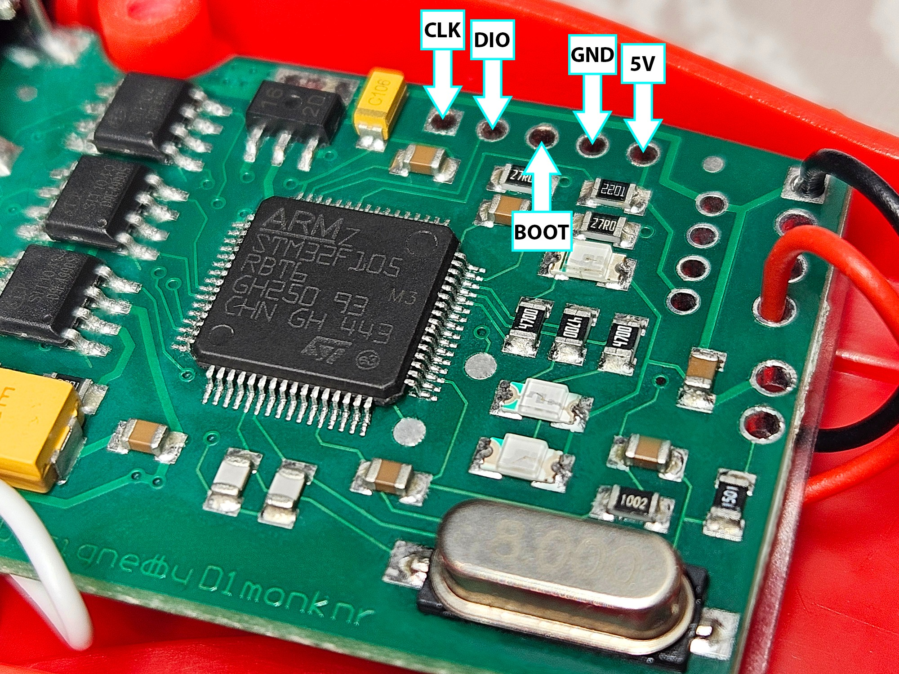

# Ford UDS Studio for macOS

Ford diagnostic and UDS utility for macOS with VBF support, flashing tools, CAN monitoring, and **RED UCDS / CH-3.2** serial transport support.

## Download

### Latest release — v2.11.0

**macOS DMG:**  
https://github.com/Radzio442/Ford-UDS-Studio-MAC/releases/download/v2.11.0/Ford_UDS_Studio_2.11.0_macOS.dmg

**Release page:**  
https://github.com/Radzio442/Ford-UDS-Studio-MAC/releases/tag/v2.11.0

File:

```text
Ford_UDS_Studio_2.11.0_macOS.dmg
Size: 55.28 MiB
SHA-256: 70267f118c6fd681586286540b8f87d3309721671fdf82a3fccdabd14c8ee3c4
```

## Features

- Ford UDS diagnostic communication
- VBF parsing and utility tools
- flashing support
- CAN communication
- FordLink transport
- RED UCDS / CH-3.2 support
- CAN1 / CAN2 support
- USB CDC serial communication
- macOS application build and DMG release workflow

## RED UCDS / CH-3.2

The repository includes a ready-to-flash combined Intel HEX image for the RED UCDS / CH board:

```text
firmware/RED_UCDS/bl_ch_combined.hex
```

Firmware SHA-256:

```text
56c62c69dcdecffb486e908e68ad46ec01833149de34f504507e19a05cc9d5e5
```

### Flash layout

| Region | Address range | Data size |
|---|---:|---:|
| Bootloader | `0x08000000` – `0x08002733` | 10,036 bytes |
| CH application | `0x08004000` – `0x0800813F` | 16,704 bytes |

The gap between `0x08002734` and `0x08003FFF` is not programmed by the combined HEX.

The CH application contains:

```text
CH-3.2
STMicroelectronics
STM32 Virtual COM Port
```

The FordLink backend is intended for the same **CH-3.2 / STM32F105** protocol and uses USB CDC serial communication at **1,000,000 baud**.

Full firmware notes:

[`firmware/RED_UCDS/README.md`](firmware/RED_UCDS/README.md)

## RED UCDS SWD pinout



Pads shown in the photo:

| Board marking | Function |
|---|---|
| `CLK` | SWCLK |
| `DIO` | SWDIO |
| `BOOT` | BOOT0 |
| `GND` | Ground |
| `5V` | Board supply |

For normal SWD programming use **SWCLK, SWDIO and GND**, plus suitable board power for your setup.

## Flashing RED UCDS firmware

Example with STM32CubeProgrammer:

```bash
STM32_Programmer_CLI \
  -c port=SWD \
  -w firmware/RED_UCDS/bl_ch_combined.hex \
  -v \
  -rst
```

The Intel HEX already contains the absolute flash addresses, so a separate start address is not required.

> Before flashing, keep a backup of the original MCU flash. Verify the exact STM32F105 device fitted to your board before changing option bytes or performing a full-chip erase.

## Repository structure

```text
Ford-UDS-Studio-MAC/
├── README.md
├── BUILD_MACOS.md
├── VERSION
├── requirements.txt
├── ford_uds_studio.py
├── config/
├── ford/
├── fordlink/
├── studio/
├── tools/
├── docs/
│   └── red_ucds_swd.jpg
├── firmware/
│   └── RED_UCDS/
│       ├── README.md
│       └── bl_ch_combined.hex
└── OBD_CH_GS/
    ├── bl.bin
    ├── ch.bin
    └── gs.bin
```

Generated `build/`, `dist/`, and DMG files are intentionally excluded from the Git repository. Release binaries are published under **GitHub Releases**.

## Build on macOS

See:

[`BUILD_MACOS.md`](BUILD_MACOS.md)

Typical setup:

```bash
python3 -m venv .venv
source .venv/bin/activate
pip install -r requirements.txt
```

Then follow the build instructions in `BUILD_MACOS.md`.

## Useful tools

The repository also contains standalone utilities including:

```text
vbfextract.py
vbfmake.py
vbflasher.py
vbflasher2.py
tools/fordlink_probe.py
tools/fordlink_uds_probe.py
```

## Updating the repository

After making changes:

```bash
git add .
git commit -m "Update Ford UDS Studio"
git push
```

Large application binaries such as `.dmg` files should be uploaded to **GitHub Releases**, not committed directly to the repository.

## License

See [`LICENSE`](LICENSE).

## Disclaimer

Use diagnostic and flashing functions carefully. Incorrect programming, power loss during flashing, incompatible firmware, or incorrect hardware selection can leave a module or adapter inoperable. Keep original backups before modifying firmware.
